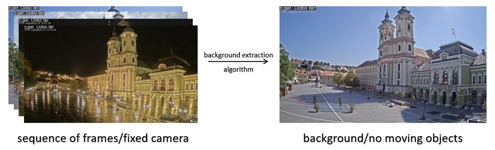
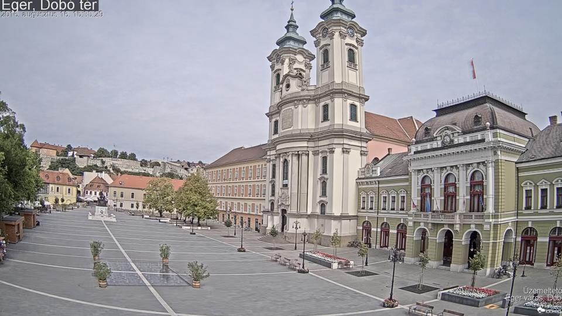

# background-subtraction

The aim of `background-subtraction` is to separate the background of the video and the moving objects, the video should be taken using a static camera (typically a surveillance camera), the moving objects could be people, cars,... etc.  

In the used method, I pick a window of <i>K</i> consecutive frames, so that the lighting is (almost) constant, the window should neither be too tight nor too wide. The chosen window is called <i> buffer</i>.

<ul>
    <li> <b>Input</b>: (k * width * height * depth) matrix.
 </li>
 <li> <b>Output</b>: (width * height * depth) matrix, which represent the background.
 </li>
</ul>

The median filter is used to eliminate the moving objects and non-stationary parts of the image. <a href="https://en.wikipedia.org/wiki/Median_filter">Median filter (Wikipedia)</a>

The median filter performs perfectly when no lighting changes. In order to overcome the lighting change issue, I perform <i>Pixel Standardization</i>:
<ul>
    <li> Translate pixel values to have a zero mean.
 </li>
 <li> Scale pixel values to have unit variance.
 </li>
</ul>

(1) Each frame channel is standardized independently. (2) The original mean and variance are recorded. (3) Perform median filter on pixel values, means, and variances. (4) Restore the background to the original mean and variance.
 

